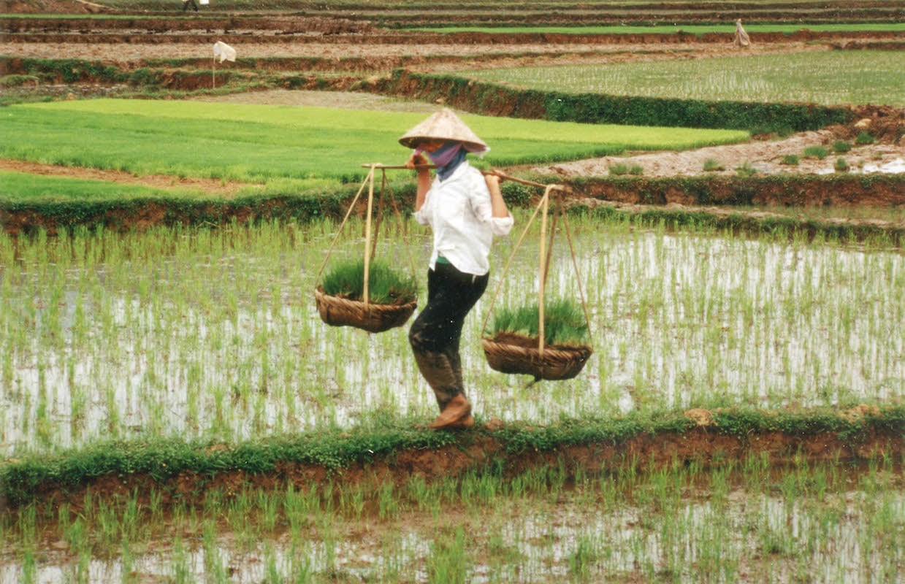

```{css my-header, echo = FALSE}
.page-header {
    background: black;
    background-image: url("img/fishermen_dark.png");
    background-size: cover;       /* Ensures the image covers the entire banner */
    height: 500px;                /* Adjust height */
    width: 100%;                  /* Makes the banner full width */
    background-position: center;  /* Centers the image */
    color: white;
}

.project-name {
    margin-top: 1rem;             /* Shift title, author, and date slightly down */
}

.main-content, .toc {
    padding: 0 4rem;              /* Reduces gap between banner and caption */
}

.title {
    font-size: 35px;              /* Title font */
    font-weight: bold;
    font-family: "Trebuchet MS",sans-serif;
}

.author, .date {
    font-size: 20px;              /* Author and date font */
    font-family: "Trebuchet MS",sans-serif;
}

.csl-bib-body {
    font-size: 13.5px;              /* References font */
    font-family: "Georgia", serif;
    margin-bottom: 50px;          /* Increase padding with bottom of page */
}

.body, p {
    font-family: "Georgia", serif;                /* Body text font */
}

.body, h1 {
    font-family: "Trebuchet MS",sans-serif;       /* Header text font */
  }

.main-content h1 {
    color: black;                                 /* Header text font */
    font-weight: bold;
}
```

<body style="background-color:#fffff8;">

```{r setup, warning = FALSE, message = FALSE, include = FALSE}
knitr::opts_chunk$set(echo = FALSE)

library(tidyverse)
library(sf)
library(ggplot2)
library(patchwork)
library(ghibli)
library(ggrepel)
library(ggtext)
library(glue)
library(showtext)
library(sysfonts)
library(plotly)

font_add_google("Playfair Display", "playfair")
showtext_auto()
```
<font size="2"> Fishermen on the Tonle Sap Lake of the Mekong River Basin [@discovery] </font> 
<br />
<br />

```{r load_data}
# Load data
# Mekong river basin
countries <- read_sf("Data/Mekong_basin_countries/Mekong_basin_countries.shp")
basin <- read_sf("Data/Mekong_basin_delta/Mekong_basin_delta.shp")

# Dams
dams <- read_sf("Data/Dams_1055/Dams_1055.shp")
dams_main <- read_sf("Data/Dams_mainstream/Dams_mainstream.shp")
dams1980 <- read_sf("Data/1980/1980.shp") # 1980
dams1990 <- read_sf("Data/1990/1990_combi.shp") # 1990
dams2000 <- read_sf("Data/2000/2000_combi.shp") # 2000
dams2010 <- read_sf("Data/2010/2010_combi.shp") # 2010
dams2020 <- read_sf("Data/2020/2020_combi.shp") # 2020

# River and lake
river1 <- read_sf("Data/River_1/FLOW1_STRA_3_China.shp") # upper course
river2 <- read_sf("Data/River_2/FLOW1_STRA_5.shp") # middle course
river3 <- read_sf("Data/River_3/FLOW3_CLASS2_TS.shp") # lower course
lake <- read_sf("Data/Lake/HydroLAKES_TS_finer.shp") # Tonle Sap Lake
```

The Mekong River is the pulsing lifeline of Southeast Asia. With almost 1,200 
unique fish species --- of which 400 are found nowhere else on Earth --- its 
rich biodiversity is rivaled only by the Amazon and the Congo. 

As the world's largest inland fishery, the Mekong accounts for more than 15% of 
global freshwater catch, supporting over 60 million locals dependent on the 
fishing industry. The Mekong Delta, known as the "rice bowl of Southeast Asia", 
contributes to 15% of global rice exports [@tri2012hydrology]. It is a vital 
agricultural region formed where the river meets the sea, home to nearly 20 
million people in the agriculture and aquaculture industry. 

Yet, the Mekong River is now clogged by a massive network of dams. Over 600 dams 
have been built or are being built across the Mekong River and its tributaries. 
Another 400 are being planned for the next decade, expanding the current network 
by 60% and pushing the total projected dam count to exceed one thousand 
[@ang2023dams].

```{r dinos3, message = FALSE, warning = FALSE, out.width = "100%", fig.align = "center", dpi=300, fig.height = 4.75, fig.width = 7}
# Define palette
palette1 = ghibli_palette("MononokeMedium",direction=1)[c(3,2,4,6,5,7)]

# Reorder countries from upstream to downstream
countries$NAME <- factor(countries$NAME,
                         levels = c('China','Myanmar','Laos','Thailand',
                                    'Cambodia','Vietnam'), ordered = TRUE)

# Annotations
annotation_text1a <- glue("<span style='color:#91b3ba;'>**The Mekong River Basin**</span><br>includes the <span style ='color:#3981A4;'>**mainstream<br>Mekong**</span> and its tributaries.")
annotation_text1b <- glue("**<span style='font-size: 14px;'>Over 600 dams</span><br><span style='color:#6A4E8E;'>operating/ being built**</span>")
annotation_text1c <- glue("**<span style='font-size: 14px;'>400 dams</span><br><span style='color:#C66125;'>being planned**</span>")

# Map of countries, with colours corresponding to the bar graph
h1 <- ggplot()+
  geom_sf(data = basin, color = "transparent", fill = alpha(palette1[6],0.85)) + # delta in Vietnam
  geom_sf(data = countries, aes(fill = NAME), color = "transparent") + # countries
  geom_sf(data = rbind(river1, river2, river3), color = "#3981A4") + # river
  geom_sf(data = lake, fill = "#3981A4", color = "transparent") + # Tonle Sap Lake
  scale_fill_manual(values = alpha(palette1,0.7)) + 
  geom_text(aes(x = 101.8, y = 28, label = "China"),
                size = 9/.pt, colour = palette1[1]) +
  geom_text(aes(x = 96.5, y = 21.5, label = "Myanmar"),
                size = 9/.pt, colour = palette1[2]) +
  geom_text(aes(x = 106.2, y = 20, label = "Laos"),
                size = 9/.pt, colour = palette1[3]) +
  geom_text(aes(x = 98.3, y = 16.5, label = "Thailand"),
                size = 9/.pt, colour = palette1[4]) +
  geom_text(aes(x = 100.3, y = 11.6, label = "Cambodia"),
                size = 9/.pt, colour = palette1[5]) +
  geom_text(aes(x = 107.8, y = 10.8, label = "Vietnam"),
                size = 9/.pt, colour = "#ada272") +
  theme_void() + 
  theme(legend.position = "none")

# Base map of mekong basin
hbase <- ggplot() +
  geom_sf(data = basin, fill = "#CDE1E5", color = "transparent") + # lower basin
  geom_sf(data = rbind(river1, river2, river3), color = "#3981A4") + # river
  geom_sf(data = lake, fill = "#3981A4", color = "transparent") + # Tonle Sap Lake
  theme_void() +
  theme(legend.position = "none") #"inside",
        #legend.position.inside = c(0.35,0.15)) # legend at bottom left

# With operating/ constructing dams
h2 <- hbase + 
  geom_sf(data = dams %>% 
            filter(Status == "Operational" | Status == "Under construction"),
          pch = 22, aes(fill = "#6A4E8E"), color = "white", size = 1.8, stroke = 0.3) + 
          # pch 22: square markers, color: border, size: marker size, stroke: border thickness
  scale_fill_manual(values = "#6A4E8E",
                    name = "",
                    label = "Operating\nConstructing") + 
  geom_richtext(aes(x = 99, y = 30.2, label = annotation_text1a),
                size = 8/.pt,
                colour = "grey30",
                hjust = 0,
                fill = NA,
                label.color = NA) + 
  geom_richtext(aes(x = 101, y = 27, label = annotation_text1b),
                size = 8/.pt,
                colour = "grey30",
                hjust = 0,
                fill = NA,
                label.color = NA)

# With planned dams
h3 <- hbase + 
  geom_sf(data = dams %>% 
            filter(Status == "Planned"),
          pch = 22, aes(fill = "#C66125"), color = "white", size = 1.8, stroke = 0.3) +
  scale_fill_manual(values = "#C66125",
                    name = "",
                    label = "Planned") + 
  geom_richtext(aes(x = 101, y = 27, label = annotation_text1c),
                size = 8/.pt,
                colour = "grey30",
                hjust = 0,
                fill = NA,
                label.color = NA)

# Mainstream dams
# h3 <- hbase + 
#   geom_sf(data = dams_main %>% 
#             filter(Status == "Operational" | Status == "Under construction"),
#           pch = 22, fill = "#6A4E8E", color = "white", size = 1.8, stroke = 0.3) + 
#   geom_sf(data = dams_main %>% 
#             filter(Status == "Planned"),
#           pch = 22, fill = "#C66125", color = "white", size = 1.8, stroke = 0.3) + 
#   annotate("text", x = 99.9, y = 10.7, label = "Mainstream", size = 9/.pt) # mainstream label

h1 + h2 + h3 + plot_annotation(
  title = "Dam network in the Mekong River Basin", 
  caption = "Source: Dams were compiled from 18 dam databases (Ang et al. 2023).") & 
  theme(plot.title = element_text(size = 14, face = "bold"),
        plot.caption = element_text(size = 8, hjust = 0),
        plot.background = element_rect(fill = "#fffff8", color = NA))
```
<br />

# Hydropower generation will double

The 3,000-mile Mekong is Southeast Asia's longest river, flowing through six 
countries: China, Myanmar, Laos, Thailand, Cambodia, and Vietnam [@hirsch2016shifting]. 
As these nations are experiencing rapid economic and population growth, dams --- a 
relatively low-cost energy source in this water-rich region --- have proliferated 
across the Mekong River Basin in response to rising energy demands 
[@hecht2019hydropower; @IRENA]. All six countries are competing for their share 
of the river while racing to dominate the hydropower market. 

The total hydropower capacity, or the maximum power that can be generated by the 
entire dam network, had expanded exponentially from one gigawatt in the 1980s, 
to 35 gigawatts in the 2010s, and is projected to double to 70 gigawatts in the 2020s 
and beyond. 

China was the first to harness the Mekong's hydropower potential [@cronin2009mekong], 
as evidenced by its substantial expansion in hydropower capacity from the 2000s 
to the 2010s in the following graph. Having built 11 dams along the upper segment 
of the mainstream Mekong, China had become the focal point of discussions regarding the 
Mekong Basin, with many expressing concerns about the impact of upstream dams on 
reducing the water flow to downstream countries [@brianeyler]. However, the pace 
of dam construction in China is slowing as development gains momentum downstream. 

```{r slope_plot, message = FALSE, warning = FALSE, out.width = "100%", fig.width = 6, fig.align = "center", fig.height = 4, dpi = 300}
# Define function to sum hydropower per country per decade
bycountry <- function(hpyear,year){
  hpyear %>% 
  st_drop_geometry() %>%
  dplyr::select(Capacity_M, Country) %>%
  group_by(Country) %>%
  summarise(Capacity = sum(Capacity_M, na.rm = T)) %>%
  mutate(decade = year)
}

# Run function to sum hydropower
# Note: Myanmar only appears in 2010, so add in a row for Myanmar until 2000
country1980 <- bycountry(dams1980,1980) %>%
  rbind(.,data.frame(Country = "Myanmar",Capacity = 0, decade = 1980)) 
country1990 <- bycountry(dams1990,1990) %>%
  rbind(.,data.frame(Country = "Myanmar",Capacity = 0, decade = 1990))
country2000 <- bycountry(dams2000,2000) %>%
  rbind(.,data.frame(Country = "Myanmar",Capacity = 0, decade = 2000))
country2010 <- bycountry(dams2010,2010)
country2020 <- bycountry(dams2020,2020)
countryall <- rbind(country1980,country1990,country2000,country2010,country2020)

# Reorder countries for a more organised slope graph
countryall$Country <- factor(countryall$Country,
                             levels = c('Thailand','Myanmar','Cambodia',
                                        'Vietnam','Laos','China'),ordered = TRUE)

# Define palette
palette2 = ghibli_palette("MononokeMedium",direction=1)[c(6,2,5,7,4,3)]

# Annotation
annotation_text2 <- glue("While <span style='color:#3D4F7DFF;'>**China**</span> had the fastest increase in <br> hydropower capacity from the 2000s to <br> 2010s, its growth is slowing down, with <br> <span style='color:#657060FF;'>**Laos**</span> emerging as the new dam hotspot <br> in the 2020s and beyond.")

# Slope graph of hydropower per country over time
ggplot(countryall %>%
               filter(decade > 1990), 
             aes(x = decade, y = Capacity, group = Country, 
                 label = Country, col = Country)) + # colour labels
  geom_line(aes(color = Country), size = 2) +
  geom_point(aes(color = Country), size = 4) + 
  # Add another layer of points for China and Laos to fix drawing order
  geom_point(data = countryall %>%
               filter(decade > 1990 & Country == "Laos" | decade > 1990 & Country == "China"), 
             aes(color = Country), size = 4) + 
  scale_y_continuous(limits = c(NA,35000),
                     breaks=c(0,10000,20000,30000),
                     labels=c("0 GW","10 GW","20 GW","30 GW")) + # GW for cleaner graph
  scale_x_continuous(breaks=c(2000,2010,2020),
                     labels = c("2000s","2010s","Post-\n2020s"),
                     expand = expansion(mult = c(0.05,0.2))) +
  scale_color_manual(values = c(alpha(palette2[1:4],0.5),alpha(palette2[5:6],0.85)), name = NULL) +
  geom_text_repel(data = countryall %>%
                    filter(decade == 2020),
                  aes(label = Country,
                      hjust = "left",
                      fontface = "bold"),
                  nudge_x = 1, 
                  segment.color = NA,
                  size = 3,
                  direction = "y") + # repel labels in y direction
  geom_richtext(aes(x = 2000, y = 30000,
                     label = annotation_text2),
                size = 8/.pt, 
                colour = "grey30",
                hjust = 0,
                fill = NA,
                label.color = NA) +
  labs(x = NULL, y = NULL,
       title = "Rise of hydropower capacity in the Mekong",
       subtitle = "Comparison across countries",
       caption = "Source: Ang et al. 2023. GW stands for gigawatts. Colors of countries correspond to map above. 
Post-2020s data include known dams under construction and planned dams.") +
  theme(plot.title = element_text(size = 12, face = "bold", hjust = 0.11),
        plot.subtitle = element_text(size = 10, hjust = 0.06),
        axis.ticks = element_blank(),
        axis.text = element_text(size=8),
        panel.background = element_rect(fill = "#fffff8", color = NA),
        panel.grid.major.x = element_line("grey80", size = 0.1),
        panel.grid.major.y = element_blank(),
        panel.grid.minor = element_blank(),
        legend.position = "none",
        plot.background = element_rect(fill = "#fffff8", color = NA),
        # adjusting hjust causes an indent in the second line of caption
        # so adjust it using margin instead
        plot.caption = element_text(size=7, hjust = 0, margin=margin(10,0,0,15)))
```
<br />

# Laos as the next dam hotspot

With an ambitious goal of becoming the "Battery of Southeast Asia", Laos has the 
most planned dams and the highest expected growth in hydropower capacity of nearly 
20 gigawatts over the next decade. Laos was the third-largest exporter of 
electricity globally in 2020, with 90% imported by Thailand, and its exports are 
projected to more than triple by 2030 [@chowdhury2020expected; @obsecon]. 

As shown in the sequence of maps below, Laos' hydropower capacity is expected to 
grow significantly in the 2020s and beyond. The volume of a river's flow increases 
downstream as more rainfall is progressively captured, and Laos' strategic location 
along the lower mainstream Mekong provides key access to the greater flow volumes, 
which can be harnessed for increased hydropower [@biba2012china].

```{r interactive, warning = FALSE, message = FALSE, out.width = '100%', fig.align='center'}
# Define title and subtitle 
title12 <- glue("Growing hydropower in <span style='color:#657060FF;'>Laos</span>")

# Add geometry to countryall
countries <- countries %>% rename(Country = COUNTRY) # rename for joining
countryall_withgeom <- left_join(countryall,
                                 countries %>% 
                                   dplyr::select(geometry,Country),
                               by = "Country") %>% # left join geometries to country data
  st_as_sf(crs = st_crs(basin)) # turn into sf for mapping

# Decadal labels for the map
annotations <- data.frame(
  decade = c(1980, 1990, 2000, 2010, 2020),
  label = c("1980s", "1990s", "2000s", "2010s", "Post-2020s")
)

# Legend labels
countryall_withgeom <- countryall_withgeom %>%
  mutate(CustomLabel = case_when(
    ntile(Capacity, 5) == 1 ~ "Very low",
    ntile(Capacity, 5) == 2 ~ "Low",
    ntile(Capacity, 5) == 3 ~ "Medium",
    ntile(Capacity, 5) == 4 ~ "High",
    ntile(Capacity, 5) == 5 ~ "Very high"
  )) %>%
  mutate(GW = round(Capacity/1000,2))

# Reorder legend labels
countryall_withgeom$CustomLabel <- factor(countryall_withgeom$CustomLabel,
                         levels = c('Very low','Low','Medium','High',
                                    'Very high'), ordered = TRUE)

# Save ggplot to handle
p <- ggplot() +
  geom_sf(data = basin, fill = "#D6D6FF", color = "transparent") +
  geom_sf(data = countryall_withgeom,
          aes(fill = CustomLabel, 
              text = paste(Country,": ", GW, " GW", sep="")), # Add hover text
          color = "transparent") +
  facet_wrap(~decade, nrow = 1) +
  scale_fill_manual(values = c("#D6D6FF", "#B2B4F0", "#6B7ED4", "#4561BF","#003995"),
                    name = "Hydropower capacity") +
  geom_text(data = annotations, aes(x = 100, y = 8, label = label), size = 11/.pt) + # decadal labels
  theme_void() +
  labs(title = title12) +
  theme(
    strip.text.x = element_blank(),
    legend.position = "bottom",
    plot.title = element_markdown(size = 18, face = "bold", margin = margin(0, 0, 15, 0)),
    plot.background = element_rect(fill = "#fffff8", color = NA),
    panel.background = element_rect(fill = "#fffff8", color = NA),
    axis.line = element_blank()
  )

# Convert ggplot to interactive plot
interactive_map <- ggplotly(p, tooltip = "text", height = 360, width = 900) %>%
  layout(
    legend = list(
      orientation = "h",  # Horizontal legend
      x = 0.5,            # Centered horizontally
      y = -0.05,          # Move it below the plot
      xanchor = "center",
      yanchor = "top"
    )
  )

# Display interactive map
interactive_map
```
<font size="2.8"><span style="font-family: 'Open Sans', verdana, sans-serif;margin-top: 0;color:#000000;">Source: Ang et al. 2023. Hover cursor over countries to view hydropower capacity value in gigawatts.</span></font>
<br />
<br />

```{r dinos5, message = FALSE, warning = FALSE, out.width = "100%", fig.align = "center", fig.height = 3.15, fig.width = 7, dpi=300, eval = FALSE}
# This is the original static map (no longer included in the html)
# Maps of hydropower capacity over the decades
ggplot()+
  geom_sf(data = basin, fill = "#D6D6FF", color = "transparent") + 
  geom_sf(data = countryall_withgeom, aes(fill = as.factor(ntile(Capacity, 5))), # quintiles
          color = "transparent") +
  facet_wrap(~decade, nrow = 1) + # 1 map for each decade
  scale_fill_manual(values = c("#D6D6FF","#B2B4F0","#6B7ED4","#4561BF","#003995"),
                    name = "GW",
                    labels = c("0","","","","33")) + 
  geom_sf(data = countries %>%
            filter(NAME == "Laos"), fill = "transparent", color = "#657060FF", linewidth = 1) +
  geom_text(data = annotations, aes(x = 100, y = 8, label = label), size = 9/.pt) + # decadal labels
  theme_void() + 
  labs(title = title12,,
       caption = "Source: Ang et al. 2023. Color of Laos corresponds to figures above.") +
  theme(
  strip.text.x = element_blank(), # remove facet wrap labels
  legend.position = "inside",
  legend.position.inside = c(0.97,0.74), # legend at top right
  legend.key.height = unit(0.4, "cm"), # reduce legend key size
  legend.key.width = unit(0.4, "cm"),
  legend.title = element_text(size = 8),
  legend.text = element_text(size = 8),
  plot.margin = margin(t = 5, r = 5, b = 5, l = 5),
  plot.caption = element_text(hjust = 0, margin = margin(10,0,0,0)),
  plot.title = element_markdown(size=14,face="bold", margin = margin(0,0,10,0)),
  plot.background = element_rect(fill = "#fffff8", color = NA)
)
```

# Livelihoods and food security

<font size="2"> Farmer in a paddy field on the Mekong Delta [@mekongeye] </font> 
<br />
<br />

While dams are viewed as an alternative energy source to depleting fossil fuels, 
the surge in dam construction has become a threat to local livelihoods and 
regional food security. Dams fragment the river and obstruct the migratory routes 
for 5 billion fishes on the move, disrupting breeding patterns and contributing 
to the concerning reality that one-fifth of the Mekong River's fish are now at 
risk of extinction [@wwf; @tang2021removing].

Dams also block nutrient-rich sediments carried by the river from reaching the 
Mekong Delta. Starving the delta of these sediments is causing it to 
shrink and lose nutrients, jeopardizing food production and the livelihoods of 
locals in the agricultural sector [@grill2014development]. 

Amidst the dam-building boom, safeguarding local communities and food security 
is crucial. However, dam planning and management in the Mekong is often haphazard 
and marred by embezzlement [@matthews2012water]. Given limited resources, it 
would be strategic to target efforts in areas of greatest concern. 

Laos' plans for seven new massive dams on the Mekong mainstream, along with 
Cambodia's plans for two, could collectively prevent up to 96% of river sediments 
from reaching the delta [@kondolf2014dams]. Future dam management efforts should 
focus on Laos, the emerging hotspot for hydropower development. 
<br />
<br />

# References
